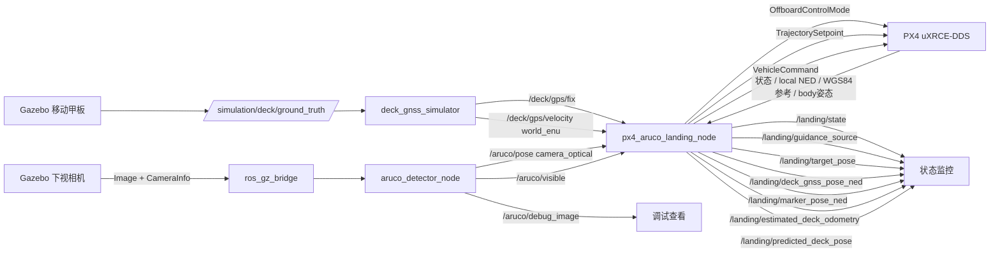

# 移动船舶无人机自主降落实现总览

本文档按当前源码梳理 `ws_aruco_landing` 的运行链路。当前开发阶段为：

```text
P3：视觉状态估计与短时运动预测
```

当前主路径能够完成：

```text
起飞
→ 船舶 GNSS 会合
→ 以移动 GNSS 中心搜索 ArUco
→ 完整刚体变换得到 Marker local NED 位姿
→ GNSS—视觉平滑接管
→ 安全高度视觉跟踪
→ 估计甲板位置、速度和协方差
→ 发布短时预测位置
→ 视觉长时丢失后恢复到 GNSS
```

**P3 主路径不会下降。** 默认 `enable_auto_land=false`，预测位置只用于监控和评估，
尚未进入 PX4 setpoint。旧静态下降代码只作为 P0 历史基线保留，从当前主路径不可达。

详细约束和验收记录：

- [传统基线实施计划](TRADITIONAL_BASELINE_PLAN.md)
- [下一阶段完整开发计划](NEXT_DEVELOPMENT_PLAN.md)
- [坐标系与变换契约](COORDINATE_FRAMES.md)
- [P2B 船舶 GNSS 仿真验收](P2B_DECK_GNSS_VALIDATION.md)
- [P2C GNSS 会合与移动搜索验收](P2C_GNSS_RENDEZVOUS_VALIDATION.md)
- [P2D GNSS—视觉接管验收](P2D_GNSS_VISION_HANDOVER_VALIDATION.md)
- [P3 视觉状态估计详细计划](P3_VISUAL_STATE_ESTIMATION_PLAN.md)
- [P3 视觉状态估计验收](P3_VISUAL_STATE_ESTIMATION_VALIDATION.md)

旧公式文档仍用于解释 P0 静态基线：

- [ArUco 检测公式](aruco_detector_formulas.md)
- [P0 静态控制公式](px4_aruco_landing_formulas.md)

---

## 1. 当前系统数据流



Ground Truth 只允许进入仿真传感器和后续评测器。控制器与检测器禁止订阅：

```text
/simulation/deck/ground_truth
```

---

## 2. ROS 2 包职责

| 包 | 当前职责 |
| --- | --- |
| `aruco_detector` | 图像同步、指定 ID 检测、PnP 完整位姿、可见性和调试图像 |
| `moving_deck_sim` | 水平移动甲板、确定性 reset、Ground Truth 和船舶 GNSS 传感器仿真 |
| `aruco_precision_landing_cpp` | PX4 Offboard、GNSS 会合、完整视觉变换、平滑接管、视觉跟踪、状态估计、短时预测和 GNSS 恢复 |

### 2.1 关键纯数学模块

| 模块 | 职责 |
| --- | --- |
| `coordinate_transform` | ENU/NED 和三维刚体变换 |
| `geodetic_converter` | WGS84、ECEF、局部 ENU 双向转换 |
| `gnss_rendezvous_guidance` | GNSS 稳定性、跳变、超时、目标限幅和移动中心搜索 |
| `visual_handover_guidance` | 视觉测量过滤、GNSS 一致性、线性接管、丢失分类和目标限幅 |
| `target_state_estimator` | 三维常速度 Kalman Filter、时间异常、离群点和长时重初始化 |
| `motion_predictor` | 根据观测到达年龄和固定补偿执行受限常速度外推 |
| `gnss_sensor_model` | GNSS 降频、噪声、延迟、丢包和确定性 reset |

---

## 3. 当前主要接口

### 3.1 船舶 GNSS 仿真

| 方向 | 话题 | 类型 | 坐标语义 |
| --- | --- | --- | --- |
| 输入 | `/simulation/deck/ground_truth` | `nav_msgs/msg/Odometry` | Gazebo world ENU，仅仿真内部 |
| 输入 | `/simulation/episode/reset_count` | `std_msgs/msg/UInt32` | 成功 reset 序号 |
| 输出 | `/deck/gps/fix` | `sensor_msgs/msg/NavSatFix` | WGS84 |
| 输出 | `/deck/gps/velocity` | `geometry_msgs/msg/TwistStamped` | `world_enu`：East、North、Up |

### 3.2 控制器输入

| 话题 | 类型 | 用途 |
| --- | --- | --- |
| `/fmu/out/vehicle_status` | `px4_msgs/msg/VehicleStatus` | Offboard 和解锁状态 |
| `/fmu/out/vehicle_local_position` | `px4_msgs/msg/VehicleLocalPosition` | local NED、有效标志和 WGS84 参考原点 |
| `/fmu/out/vehicle_odometry` | `px4_msgs/msg/VehicleOdometry` | `body_frd → local_ned` 位置和完整姿态 |
| `/deck/gps/fix` | `sensor_msgs/msg/NavSatFix` | 船舶位置粗引导 |
| `/deck/gps/velocity` | `geometry_msgs/msg/TwistStamped` | 船舶 ENU 速度和新鲜度校验 |
| `/aruco/pose` | `geometry_msgs/msg/PoseStamped` | Marker 在 `camera_optical` 中的 PnP 完整位姿 |
| `/aruco/visible` | `std_msgs/msg/Bool` | 视觉可见性和稳定捕获判断 |

当前 `/aruco/pose.header.frame_id` 默认为 `camera_link`，但数值语义始终是 OpenCV
`camera_optical`：右、下、前。控制器通过参数检查字符串，并按光学坐标解释数值。

### 3.3 控制器输出

| 话题 | 类型 | 用途 |
| --- | --- | --- |
| `/fmu/in/offboard_control_mode` | `px4_msgs/msg/OffboardControlMode` | 声明 PX4 位置控制 |
| `/fmu/in/trajectory_setpoint` | `px4_msgs/msg/TrajectorySetpoint` | local NED 目标 |
| `/fmu/in/vehicle_command` | `px4_msgs/msg/VehicleCommand` | Offboard 和 Arm 命令 |
| `/landing/state` | `std_msgs/msg/String` | 当前状态 |
| `/landing/guidance_source` | `std_msgs/msg/String` | GNSS、混合、视觉或恢复来源 |
| `/landing/target_pose` | `geometry_msgs/msg/PoseStamped` | 当前 local NED setpoint |
| `/landing/deck_gnss_pose_ned` | `geometry_msgs/msg/PoseStamped` | 船舶 GNSS 粗位置 |
| `/landing/marker_pose_ned` | `geometry_msgs/msg/PoseStamped` | 完整刚体变换后的 Marker 位姿 |
| `/landing/estimated_deck_odometry` | `nav_msgs/msg/Odometry` | 滤波位置、速度和协方差 |
| `/landing/predicted_deck_pose` | `geometry_msgs/msg/PoseStamped` | 受限短时常速度预测位置 |

---

## 4. 坐标系与完整视觉变换

### 4.1 船舶 GNSS

```text
world_enu = [East, North, Up]
local_ned = [North, East, Down]
```

控制器使用 PX4：

```text
VehicleLocalPosition.ref_lat
VehicleLocalPosition.ref_lon
VehicleLocalPosition.ref_alt
```

作为 local NED 对应的 WGS84 参考原点。

船舶 WGS84 转换链：

```text
WGS84
→ 以 PX4 地理参考为原点的 local ENU
→ local NED
```

GNSS 高度不控制会合高度。当前所有主路径状态使用：

```text
target_z_ned = -rendezvous_altitude_m
```

### 4.2 相机与 ArUco

```text
camera_optical = [Right, Down, Forward]
body_frd       = [Forward, Right, Down]
local_ned      = [North, East, Down]
```

运行控制器使用：

```text
T_local_ned_marker
=
T_local_ned_body_frd
*
T_body_frd_camera_optical
*
T_camera_optical_marker
```

其中：

- `T_local_ned_body_frd` 来自 PX4 `VehicleOdometry.position + q`。
- `T_body_frd_camera_optical` 来自 YAML 外参。
- `T_camera_optical_marker` 来自 ArUco PnP 完整位姿。

默认外参：

```yaml
camera_extrinsic.translation_frd_m: [0.0, 0.0, -0.10]
camera_extrinsic.rotation_wxyz: [0.70710678, 0.0, 0.0, 0.70710678]
```

四元数顺序为 `[w, x, y, z]`。错误 frame、NaN、Inf、非法四元数、乱序采样或过大
视觉跳变都会被拒绝。

---

## 5. 当前 P3 主路径与 P2D 状态机

```text
INIT
→ WAIT_FOR_PX4
→ OFFBOARD_PRE_STREAM
→ ARM_AND_TAKEOFF
→ WAIT_DECK_GNSS
→ RENDEZVOUS_GNSS
→ ACQUIRE_ARUCO
→ VISUAL_HANDOVER
→ TRACK_TARGET
```

恢复路径：

```text
VISUAL_HANDOVER / TRACK_TARGET
→ RECOVER_TO_GNSS
→ ACQUIRE_ARUCO 或 RENDEZVOUS_GNSS
```

| 状态 | 主要行为 | 退出条件 |
| --- | --- | --- |
| `WAIT_FOR_PX4` | 等待有效 PX4 状态、位置和 NED 姿态 | PX4 数据有效 |
| `OFFBOARD_PRE_STREAM` | 预发布当前位置目标 | 计数满足后发送 Offboard 和 Arm |
| `ARM_AND_TAKEOFF` | 保持起飞点并飞到 `takeoff_alt` | Offboard、Armed 且高度到达 |
| `WAIT_DECK_GNSS` | 锁定当前 XY 并保持安全高度 | GNSS 位置和速度连续稳定 |
| `RENDEZVOUS_GNSS` | 受限地跟随实时船舶 GNSS XY | 到达会合半径和安全高度 |
| `ACQUIRE_ARUCO` | 围绕实时 GNSS 中心搜索 | 稳定完整视觉位姿与 GNSS 一致 |
| `VISUAL_HANDOVER` | 线性混合 GNSS 与视觉目标 | 有效视觉接管权重达到 1 |
| `TRACK_TARGET` | 使用视觉 Marker local NED 水平目标 | 视觉长时丢失或严重异常 |
| `RECOVER_TO_GNSS` | 清除旧视觉并恢复到 GNSS 粗引导 | GNSS 有效后回会合或搜索 |

### 5.1 接管条件

必须同时满足：

- ArUco 连续可见达到 `aruco_acquire_duration_s`。
- 位姿回调新鲜。
- 完整坐标变换成功。
- GNSS 与视觉水平差小于阈值。
- 相邻视觉测量未发生异常跳变。
- 非零图像采样时间戳严格递增。

单帧误检不会触发接管。

### 5.2 接管公式

```text
alpha = clamp(valid_handover_time / visual_handover_duration_s, 0, 1)
target_xy = (1-alpha) * gnss_xy + alpha * visual_xy
```

只有视觉有效的周期才累加接管进度。混合目标继续受最大速度和单周期步长限制。

### 5.3 视觉丢失

短时丢失：

- 保持最近有效水平目标。
- 保持固定安全高度。
- 不下降。

长时丢失：

```text
TRACK_TARGET / VISUAL_HANDOVER
→ RECOVER_TO_GNSS
→ ACQUIRE_ARUCO 或 RENDEZVOUS_GNSS
```

GNSS 同时无效时进入 `WAIT_DECK_GNSS`，锁定当前无人机水平位置。

---

## 6. P3 状态估计、预测与时间边界

状态估计使用：

```text
x = [px, py, pz, vx, vy, vz]^T
```

滤波器采用三维常速度模型，使用 ArUco 非零 `header.stamp` 计算相邻观测 `dt`；零时间戳时退化使用回调到达时间。重复或倒退时间戳被拒绝，大残差测量通过 NIS 门限拒绝，长时间隔后重新初始化并清零速度。

当前 ROS `/clock`、图像时间和 PX4 时间域尚未建立严格统一映射，因此：

- 视觉控制新鲜度仍使用控制器回调到达时间。
- 完整坐标变换仍使用回调时最新 `VehicleOdometry`，尚未做图像时刻姿态插值。
- 预测时域使用“最后有效观测到达年龄 + 固定附加补偿”，并限制最大外推时域。
- 不直接计算 `controller_now - image_header_stamp`。

当前 `/landing/predicted_deck_pose` 只用于调试和离线评估，不进入 `/fmu/in/trajectory_setpoint`。

---

## 7. 旧静态基线代码

源码仍保留：

```text
GOTO_ARUCO_AREA
WAIT_ARUCO
CENTER_ABOVE_MARKER
DESCEND_WITH_TRACKING
FINAL_LAND
DONE
```

这些状态用于冻结 P0 历史基线，但当前从 `INIT` 出发的 P3 主路径不可达。默认：

```yaml
enable_auto_land: false
```

因此不能把旧下降代码的存在理解为当前已实现移动甲板降落。

---

## 8. 当前验证状态

已通过：

- P0 仓库和静态视觉链历史验证。
- P1 静止、匀速、XY 正弦移动甲板仿真。
- P2A 刚体坐标和 WGS84/ENU/NED 数学测试。
- P2B 船舶 GNSS 频率、噪声、延迟、丢包和 reset 测试。
- P2C GNSS 校验、目标限幅、移动搜索和消息级状态机测试。
- P2D 完整 Marker local NED 变换、接管、视觉跟踪、单帧误检和视觉恢复测试。
- P3 常速度 Kalman Filter、时间异常、离群点、重初始化和短时预测测试。
- P3 静止消息级输入估计速度为零。
- P3 NED East `0.4 m/s` 输入估计速度约为 `0.40023 m/s`。

完整工作区结果：

```text
3 packages finished
77 tests
0 errors
0 failures
0 skipped
```

尚未声明通过：

- 真实 PX4 动力学下的 GNSS—视觉联合飞行。
- 匀速和正弦移动甲板的视觉跟踪 RMSE。
- 真实图像和 PX4 动力学下的估计位置/速度 RMSE。
- 图像采样时刻的 PX4 位姿插值和严格时间对齐。
- 将预测位置和估计速度用于水平控制后的性能提升。
- 着陆窗口、下降、触地和批量评测。

当前 Gazebo 环境仍有相机插件问题：

```text
Failed to load system plugin libGstCameraSystem.so
```

该问题不影响纯逻辑和合成消息验收，但需要在真实视觉联合飞行前处理。
