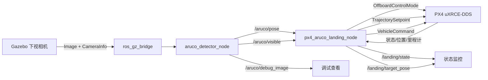

# ArUco 精准降落实现总览

本文档按当前源码梳理 `ws_aruco_landing` 的运行链路。公式推导分别见：

- [ArUco 检测公式](aruco_detector_formulas.md)
- [PX4 精准降落控制公式](px4_aruco_landing_formulas.md)
- [现有 ArUco 识别流程说明](../src/aruco_detector/ARUCO_DETECTION_FLOW.md)

## 1. 系统数据流

完整链路分为两段：

1. `aruco_detector_node` 同步相机图像与内参，识别指定 ID 的 Marker，估计其在相机光学坐标系中的位姿。
2. `px4_aruco_landing_node` 将相机平面误差映射到 PX4 local NED，持续发布位置设定点，并通过状态机完成起飞、搜索、对中、下降和最终降落。

## 2. 文件与模块职责

| 文件 | 当前职责 |
| --- | --- |
| `src/aruco_detector/src/aruco_detector_node.cpp` | 图像同步、Marker 检测、PnP 位姿估计、位姿/可见性/调试图像发布 |
| `src/aruco_detector/config/aruco_detector.yaml` | 检测器运行参数和 Gazebo 相机默认话题 |
| `src/aruco_detector/launch/aruco_detector.launch.py` | 加载参数文件并启动检测节点 |
| `src/aruco_precision_landing_cpp/include/.../px4_aruco_landing_node.hpp` | 降落状态、参数、ROS 接口和运行状态声明 |
| `src/aruco_precision_landing_cpp/src/px4_aruco_landing_node.cpp` | 参数校验、坐标变换、状态机、PX4 命令与设定点发布 |
| `src/aruco_precision_landing_cpp/config/px4_aruco_landing.yaml` | 控制频率、高度、阈值、限幅和坐标符号参数 |
| `src/aruco_precision_landing_cpp/launch/px4_aruco_landing.launch.py` | 加载控制参数，并将 PX4 带版本后缀的话题重映射到节点固定话题 |

两个包的 `CMakeLists.txt` 和 `package.xml` 只负责构建、安装与依赖声明，不包含运行公式。

## 3. ROS 2 接口

### 3.1 检测模块

| 方向 | 话题 | 类型 | 含义 |
| --- | --- | --- | --- |
| 输入 | 配置的图像话题 | `sensor_msgs/msg/Image` | 相机 BGR/可转换图像 |
| 输入 | 配置的内参话题 | `sensor_msgs/msg/CameraInfo` | 相机内参和畸变参数 |
| 输出 | `/aruco/pose` | `geometry_msgs/msg/PoseStamped` | Marker 相对相机光学坐标系的位姿 |
| 输出 | `/aruco/visible` | `std_msgs/msg/Bool` | 本次同步回调是否得到目标 Marker 的有效位姿 |
| 输出 | `/aruco/debug_image` | `sensor_msgs/msg/Image` | 绘制检测框、ID 和坐标轴的图像 |

检测失败时不会刷新 `/aruco/pose`，下游必须同时检查 `/aruco/visible` 和位姿时效。

### 3.2 降落控制模块

| 方向 | 话题 | 用途 |
| --- | --- | --- |
| 输入 | `/aruco/pose`、`/aruco/visible` | Marker 相机位姿和可见性 |
| 输入 | `/aruco/id` | 记录最近 ID；当前不参与任何状态转换或控制计算 |
| 输入 | `/fmu/out/vehicle_status` | Offboard 与解锁状态 |
| 输入 | `/fmu/out/vehicle_local_position` | local NED 位置和有效标志 |
| 输入 | `/fmu/out/vehicle_odometry` | 机体四元数，用于计算航向角 |
| 输出 | `/fmu/in/offboard_control_mode` | 声明使用位置控制 |
| 输出 | `/fmu/in/trajectory_setpoint` | local NED 位置和航向设定点 |
| 输出 | `/fmu/in/vehicle_command` | 切换 Offboard、解锁和最终 Land 命令 |
| 输出 | `/landing/state` | 当前状态机名称 |
| 输出 | `/landing/target_pose` | 当前目标点的调试表示 |

Launch 默认将节点的 `vehicle_status` 和 `vehicle_local_position` 输入分别重映射到 PX4 v1.18 的 `_v4`、`_v1` 话题。

## 4. 坐标系约定

检测器输出遵循输入相机的光学坐标系：

- camera `x`：图像向右；
- camera `y`：图像向下；
- camera `z`：镜头前方。

控制器输出使用 PX4 local NED：

- NED `x`：North；
- NED `y`：East；
- NED `z`：Down，高度约为 $h=-z$。

当前代码没有使用 TF 或完整相机外参矩阵。它先用两个可调符号把相机 `x/y` 映射为机体右/前方向，再根据当前航向角旋转到 NED。详细公式见[控制公式文档](px4_aruco_landing_formulas.md#4-marker-误差到-local-ned-的变换)。

## 5. 降落状态机

| 状态 | 目标点/动作 | 退出条件 | Marker 丢失行为 |
| --- | --- | --- | --- |
| `INIT` | 初始化状态 | 下一周期逻辑立即进入 `WAIT_FOR_PX4` | 不适用 |
| `WAIT_FOR_PX4` | 等待状态、有效 local position 和有效姿态四元数 | PX4 数据齐全后记录起飞点和初始航向 | 不适用 |
| `OFFBOARD_PRE_STREAM` | 保持起飞点当前高度，预发送位置设定点 | 计数达到 `offboard_prestream_count` 后发送 Offboard 和 Arm | 不适用 |
| `ARM_AND_TAKEOFF` | 目标为起飞点 $(x_0,y_0,-h_{takeoff})$；未成功时定时重发命令 | 已进入 Offboard、已解锁且高度误差在阈值内 | 不适用 |
| `GOTO_ARUCO_AREA` | 飞往 $(x_s,y_s,-h_s)$ | 水平距离和垂直误差均进入搜索阈值 | 不适用 |
| `WAIT_ARUCO` | 保持搜索点与搜索高度 | 位姿新鲜且连续可见计数达标 | 继续等待 |
| `CENTER_ABOVE_MARKER` | 保持当前高度，按 Marker 误差修正水平目标 | 水平误差严格小于 `center_xy_threshold` | 超时后回到 `WAIT_ARUCO` |
| `DESCEND_WITH_TRACKING` | 持续修正水平目标，并按最大下降速率增加 NED `z` | 实测高度到达 `final_alt` | 超时后进入 `ABORT` |
| `FINAL_LAND` | 锁定进入状态时的位置；可选发送一次 PX4 Land 命令 | 无条件进入 `DONE` | 不再检查 Marker |
| `DONE` | 保留最后目标并持续发布 | 无自动退出 | 不再检查 Marker |
| `ABORT` | 锁定进入状态时的水平位置，目标高度改为 `abort_hover_alt` | 无自动恢复 | 状态锁定 |

## 6. 当前实现中容易误读的细节

- 控制器源码中 `search_x/search_y` 的声明默认值为 `(0,0)`，但默认 launch 加载的 YAML 将实际运行值覆盖为 `(1,1)`。
- 检测器当前不发布 `/aruco/id`；控制器即使收到该话题也只保存数值，不用它筛选 Marker 或阻塞降落。
- `max_xy_step` 对 North、East 两轴分别限幅，所以一次目标修正的欧氏长度最大为 $\sqrt{2}\,max\_xy\_step$，它不是速度上限。
- 位姿新鲜度使用控制器收到消息时的 ROS 时钟，而不是消息 `header.stamp`。
- `enable_auto_land=false` 只会阻止发送 `VEHICLE_CMD_NAV_LAND`；状态机仍从 `FINAL_LAND` 进入 `DONE` 并保留最后位置目标。
- `ABORT` 没有自动回到搜索或对中状态，也不会自动解除电机锁定。
- 控制器只使用 ArUco 位姿的 `position.x/y`；检测器发布的 Marker 姿态和 `position.z` 当前不参与降落控制。

## 7. P0 静态基线验证

验证日期：2026-07-19。检测器和控制器分别使用现有
[`aruco_detector.yaml`](../src/aruco_detector/config/aruco_detector.yaml) 与
[`px4_aruco_landing.yaml`](../src/aruco_precision_landing_cpp/config/px4_aruco_landing.yaml)，未覆盖运行参数。

- 从 Git 索引导出的无历史、无构建缓存快照能够发现并构建两个包。
- `colcon test` 结果为 `0 tests, 0 errors, 0 failures, 0 skipped`；当前两个包尚无实际测试用例。
- 验证环境为 PX4 `v1.18.0-alpha1-371-g6f5be87b4c-dirty`、`px4_msgs 1.17.0`。
- Gazebo 相机输入和 `/aruco/debug_image` 均约为 30 Hz；控制器成功完成
  `ARM_AND_TAKEOFF → GOTO_ARUCO_AREA → WAIT_ARUCO → CENTER_ABOVE_MARKER → DESCEND_WITH_TRACKING → FINAL_LAND → DONE`。
- 无 GCS 心跳时 PX4 预飞检查不会通过；启动 QGroundControl 后正常解锁，未修改 PX4 参数或强制解锁。
- 状态机进入 `DONE` 后，PX4 已处于自动降落且垂直速度接近零，但
  `/fmu/out/vehicle_land_detected` 在额外 20 秒确认窗口内仍为 `landed=false`。

因此 P0 仓库结构、干净构建和现有视觉控制流程验证通过；静态基线的“确认触地”验收未通过。
该结果按当前 V0 行为冻结，P0 不修改控制逻辑。
