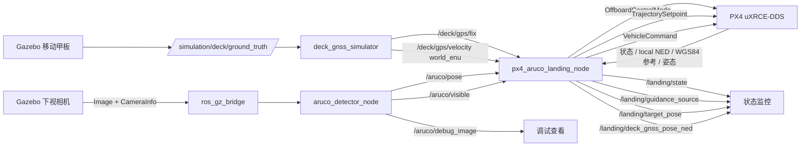

# 移动船舶无人机自主降落实现总览

本文档按当前源码梳理 `ws_aruco_landing` 的运行链路。当前开发阶段为：

```text
P2C：船舶 GNSS 会合与移动甲板上方粗跟踪
```

当前主路径能够起飞、等待船舶 GNSS、飞到移动甲板上方、围绕实时 GNSS 中心搜索
ArUco，并在稳定识别后保持安全高度悬停。**当前主路径不会下降。**

详细约束和验收记录：

- [传统基线实施计划](TRADITIONAL_BASELINE_PLAN.md)
- [下一阶段完整开发计划](NEXT_DEVELOPMENT_PLAN.md)
- [坐标系与变换契约](COORDINATE_FRAMES.md)
- [P2B 船舶 GNSS 仿真验收](P2B_DECK_GNSS_VALIDATION.md)
- [P2C GNSS 会合与移动搜索验收](P2C_GNSS_RENDEZVOUS_VALIDATION.md)

旧公式文档仍用于解释 P0 静态基线：

- [ArUco 检测公式](aruco_detector_formulas.md)
- [P0 静态控制公式](px4_aruco_landing_formulas.md)

---

## 1. 当前系统数据流



Ground Truth 只允许进入仿真传感器和后续评测器。控制器与检测器禁止订阅
`/simulation/deck/ground_truth`。

---

## 2. ROS 2 包职责

| 包 | 当前职责 |
| --- | --- |
| `aruco_detector` | 图像同步、指定 ID 检测、PnP 位姿、可见性和调试图像 |
| `moving_deck_sim` | 水平移动甲板、确定性 reset、Ground Truth 和船舶 GNSS 传感器仿真 |
| `aruco_precision_landing_cpp` | PX4 Offboard、地理转换、GNSS 校验、会合目标、移动搜索和安全悬停 |

### 2.1 关键纯数学模块

| 模块 | 职责 |
| --- | --- |
| `coordinate_transform` | ENU/NED 和三维刚体变换基础 |
| `geodetic_converter` | WGS84、ECEF、局部 ENU 双向转换 |
| `gnss_rendezvous_guidance` | GNSS 稳定性、跳变、超时、目标限幅和搜索偏移 |
| `gnss_sensor_model` | 船舶 GNSS 降频、噪声、延迟、丢包和确定性 reset |

---

## 3. 当前主要接口

### 3.1 船舶 GNSS 仿真

| 方向 | 话题 | 类型 | 坐标语义 |
| --- | --- | --- | --- |
| 输入 | `/simulation/deck/ground_truth` | `nav_msgs/msg/Odometry` | Gazebo world ENU，仅仿真内部 |
| 输入 | `/simulation/episode/reset_count` | `std_msgs/msg/UInt32` | 成功 reset 序号 |
| 输出 | `/deck/gps/fix` | `sensor_msgs/msg/NavSatFix` | WGS84 |
| 输出 | `/deck/gps/velocity` | `geometry_msgs/msg/TwistStamped` | `world_enu`：East、North、Up |

### 3.2 控制器输入

| 话题 | 类型 | 用途 |
| --- | --- | --- |
| `/fmu/out/vehicle_status` | `px4_msgs/msg/VehicleStatus` | Offboard 和解锁状态 |
| `/fmu/out/vehicle_local_position` | `px4_msgs/msg/VehicleLocalPosition` | local NED、有效标志和 WGS84 参考原点 |
| `/fmu/out/vehicle_odometry` | `px4_msgs/msg/VehicleOdometry` | 无人机姿态 |
| `/deck/gps/fix` | `sensor_msgs/msg/NavSatFix` | 船舶位置粗引导 |
| `/deck/gps/velocity` | `geometry_msgs/msg/TwistStamped` | 船舶 ENU 速度和新鲜度校验 |
| `/aruco/pose` | `geometry_msgs/msg/PoseStamped` | Marker 在 `camera_optical` 中的 PnP 位姿 |
| `/aruco/visible` | `std_msgs/msg/Bool` | 视觉可见性和稳定捕获判断 |

P2C 中 ArUco 位姿尚未参与位置控制，只用于判断是否已稳定捕获。

### 3.3 控制器输出

| 话题 | 类型 | 用途 |
| --- | --- | --- |
| `/fmu/in/offboard_control_mode` | `px4_msgs/msg/OffboardControlMode` | 声明 PX4 位置控制 |
| `/fmu/in/trajectory_setpoint` | `px4_msgs/msg/TrajectorySetpoint` | local NED 目标 |
| `/fmu/in/vehicle_command` | `px4_msgs/msg/VehicleCommand` | Offboard 和 Arm 命令 |
| `/landing/state` | `std_msgs/msg/String` | 当前状态 |
| `/landing/guidance_source` | `std_msgs/msg/String` | 当前引导子状态 |
| `/landing/target_pose` | `geometry_msgs/msg/PoseStamped` | 当前 local NED setpoint |
| `/landing/deck_gnss_pose_ned` | `geometry_msgs/msg/PoseStamped` | 船舶 GNSS 转换后的 local NED |

---

## 4. 坐标系约定

### 4.1 甲板和船舶 GNSS

```text
world_enu = [East, North, Up]
local_ned = [North, East, Down]
```

控制器使用 PX4：

```text
VehicleLocalPosition.ref_lat
VehicleLocalPosition.ref_lon
VehicleLocalPosition.ref_alt
```

作为 local NED 对应的 WGS84 参考原点。

船舶 WGS84 转换链：

```text
WGS84
→ 以 PX4 地理参考为原点的 local ENU
→ local NED
```

普通 GNSS 高度不控制会合高度。当前会合高度为固定安全高度：

```text
target_z_ned = -rendezvous_altitude_m
```

### 4.2 相机和 ArUco

```text
camera_optical = [Right, Down, Forward]
body_frd       = [Forward, Right, Down]
local_ned      = [North, East, Down]
```

后续 P2D 使用：

```text
T_local_ned_marker
=
T_local_ned_body_frd
*
T_body_frd_camera_optical
*
T_camera_optical_marker
```

当前 P2C 尚未将该完整变换接入运行控制器。

---

## 5. 当前 P2C 状态机

```text
INIT
→ WAIT_FOR_PX4
→ OFFBOARD_PRE_STREAM
→ ARM_AND_TAKEOFF
→ WAIT_DECK_GNSS
→ RENDEZVOUS_GNSS
→ ACQUIRE_ARUCO
```

| 状态 | 主要行为 | 退出条件 |
| --- | --- | --- |
| `WAIT_FOR_PX4` | 等待有效 PX4 状态、位置和姿态 | PX4 数据有效 |
| `OFFBOARD_PRE_STREAM` | 预发布当前位置目标 | 计数满足后发送 Offboard 和 Arm |
| `ARM_AND_TAKEOFF` | 保持起飞点并飞到 `takeoff_alt` | Offboard、Armed 且高度到达 |
| `WAIT_DECK_GNSS` | 锁定当前 XY，飞到/保持会合高度 | GNSS 位置和速度连续稳定 |
| `RENDEZVOUS_GNSS` | 受限地跟随实时船舶 GNSS XY | 到达会合半径和安全高度 |
| `ACQUIRE_ARUCO` | 围绕实时 GNSS 中心搜索 | P2C 不离开该状态进入视觉控制 |

### 5.1 搜索模式

没有稳定视觉时：

```text
中心 → 北 → 东 → 南 → 西 → 循环
```

每个偏移都相对当前船舶 GNSS 中心，而不是固定世界点。

### 5.2 稳定 ArUco

当 `/aruco/visible` 和 `/aruco/pose` 新鲜，并持续满足
`aruco_acquire_duration_s`：

```text
guidance_source = GNSS_ARUCO_ACQUIRED_HOLD
```

控制器停止搜索偏移并回到船舶 GNSS 中心，继续保持会合高度。当前不会切换视觉控制，
不会下降。

### 5.3 GNSS 超时

位置或速度超过超时：

```text
RENDEZVOUS_GNSS / ACQUIRE_ARUCO
→ WAIT_DECK_GNSS
```

进入等待状态时锁定当前无人机 XY，不继续使用旧船舶目标。

---

## 6. 旧静态基线代码

源码仍保留：

```text
GOTO_ARUCO_AREA
WAIT_ARUCO
CENTER_ABOVE_MARKER
DESCEND_WITH_TRACKING
FINAL_LAND
DONE
```

这些状态用于冻结 P0 历史基线，但当前从 `INIT` 出发的 P2C 主路径不可达。默认配置：

```yaml
enable_auto_land: false
```

因此不能把旧下降代码的存在理解为 P2C 已实现移动甲板降落。

---

## 7. 当前验证状态

已通过：

- P0 仓库和静态视觉链历史验证。
- P1 静止、匀速、XY 正弦移动甲板仿真。
- P2A 刚体坐标和 WGS84/ENU/NED 数学测试。
- P2B 船舶 GNSS 频率、噪声、延迟、丢包和 reset 测试。
- P2C GNSS 校验、目标限幅、移动搜索和消息级状态机测试。
- Ground Truth 隔离检查。

尚未声明通过：

- PX4 实际动力学下的 P2C 移动甲板会合闭环。
- GNSS 到视觉位置控制接管。
- 视觉状态估计、预测、速度前馈。
- 着陆窗口、下降和触地。

---

## 8. 下一阶段

```text
P2D：ArUco 完整变换、GNSS—视觉平滑接管和下降前恢复
```

P2D 仍只在安全高度运行，不实现下降。
