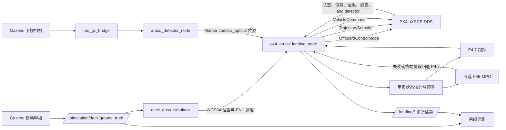

# 移动船舶无人机自主降落系统总览

## 1. 系统目标与当前状态

`ws_aruco_landing` 使用 PX4 SITL、Gazebo Harmonic 和 ROS 2 Humble 实现移动船舶甲板自主降落传统基线：

```text
船舶 GNSS / 遥测粗引导
→ 移动甲板上方会合
→ ArUco 捕获与视觉接管
→ 甲板状态估计和运动预测
→ 移动目标水平跟踪
→ 规则式着陆窗口
→ 相对高度下降
→ 最终下降与触地确认
→ 接触后相对保持
```

当前已完成：

- P8A 升沉甲板最终下降、真实接触和接触后相对保持，H1 3/3、H2 3/3 PASS；
- P8B 四状态水平相对 MPC、约束、warm start、完整 P4.7 回退和终端安全 handoff；
- P8C T1 甲板平面/X500 四滑橇几何、终端主轴法向整形、状态化接触锚点、受限垂直预压、HOLD 法向锁存和姿态安全保护；
- 全工作区 340 项测试通过；P8B 安全高度 15/15、下降 6/6、真实触地 6/6 PASS；P8C T1 active touchdown roll/pitch 3+3 为 6/6 PASS。

P8C 状态为 `RESEARCH PASS / PLAN PASS / P8C-0 IMPLEMENTATION PASS / P8C-1 VALIDATION PASS / P8C-2 SAFE DESCENT PASS / P8C-4 VALIDATION PASS / P8C T1 VALIDATION PASS / P8C-3 DESIGN GATE CLOSED`。最终旧路径回归 static/constant02/H1/H2/RELATIVE_MPC 为 9/9 PASS，所有旧场景 terminal stabilization applied 样本为 0。P8C-3 水平机体失败 Bag 与设计门历史继续保留；负倾角和动态 roll/pitch/combined 尚未开放。

相对下降和最终下降默认关闭。系统不会发送 `NAV_LAND`，不会自动 Disarm。

## 2. 系统数据流



Ground Truth 只能进入仿真传感器和离线评测器。控制器与 ArUco 检测器禁止订阅：

```text
/simulation/deck/ground_truth
```

## 3. ROS 2 包职责

| 包 | 职责 |
| --- | --- |
| `aruco_detector` | 图像同步、四尺度 Marker 检测、有状态选择、PnP 完整位姿、统一甲板中心补偿和调试图像。 |
| `moving_deck_sim` | 水平、升沉、横摇/纵摇和组合甲板运动，确定性 reset，船舶 GNSS 传感器模型和评测 Ground Truth。 |
| `aruco_precision_landing_cpp` | PX4 Offboard、GNSS 会合、视觉接管、状态估计、P4.7/MPC 跟踪、着陆窗口、下降和触地保持。 |

控制器中的主要纯逻辑模块：

| 模块 | 职责 |
| --- | --- |
| `coordinate_transform` | ENU/NED 与三维刚体变换。 |
| `geodetic_converter` | WGS84、ECEF 和局部 ENU 转换。 |
| `vehicle_pose_history` | PX4→ROS 时间映射和图像采样时刻机体位姿插值。 |
| `gnss_rendezvous_guidance` | GNSS 稳定性、跳变、超时、目标限幅和移动中心搜索。 |
| `visual_handover_guidance` | GNSS—视觉一致性、平滑接管、测量过滤和丢失恢复。 |
| `target_state_estimator` | 三维常速度 Kalman Filter、离群处理和长时重初始化。 |
| `motion_predictor` | 基于观测年龄的受限短时位置预测。 |
| `adaptive_relative_velocity_gain` | 基于估计甲板加速度的 P4.7 连续增益调度。 |
| `moving_target_tracking_controller` | 预测位置、速度前馈、相对速度阻尼和控制限幅。 |
| `relative_mpc_controller` | 四状态二维相对双积分 MPC、约束和 warm start。 |
| `deck_attitude_estimator`、`landing_window` | 视觉甲板倾角和规则式着陆窗口。 |
| `deck_plane_geometry` | P8C-0 纯数学甲板平面、X500 四滑橇端点间隙、法向/切向相对运动；仅供 shadow 诊断。 |
| `relative_descent_controller`、`vertical_state_estimator` | 相对高度分阶段下降与垂直状态估计。 |
| `final_descent_controller`、`touchdown_detector` | 终端下降和多源触地候选/确认。 |
| `touchdown_hold_controller` | 升沉甲板接触后的相对垂直保持。 |
| `terminal_contact_stabilization` | 固定正 T1 终端主轴法向整形、状态化接触锚点、切向阻尼、接触顺应、受限预压和姿态安全保护。 |

## 4. 坐标与时间契约

统一坐标系：

```text
camera_optical：右、下、前
base_link_frd：前、右、下
local_ned：北、东、下
world_enu：东、北、上
```

视觉位姿链：

```text
T_local_ned_marker
=
T_local_ned_body_frd
*
T_body_frd_camera_optical
*
T_camera_optical_marker
```

- `T_camera_optical_marker` 来自 ArUco PnP；
- `T_body_frd_camera_optical` 来自明确方向的 YAML 外参；
- `T_local_ned_body_frd` 来自 PX4 `VehicleOdometry`，并检查 `pose_frame`；
- 当前下视相机 FRD 平移为 `[0, 0, 0.14] m`。

船舶 WGS84 位置使用 PX4 `VehicleLocalPosition.ref_lat/ref_lon/ref_alt` 转换为 local ENU，再统一转换为 local NED。GNSS 高度不直接控制会合或下降高度。

视觉估计使用图像采样时间而不是消息到达时间。控制器维护 PX4 位姿历史，将 PX4 时间映射到 ROS 仿真时间，并插值获得图像曝光时刻的机体位姿。详细约束见[坐标系与变换契约](COORDINATE_FRAMES.md)。

## 5. 主要 ROS 接口

### 5.1 传感器与 PX4 输入

| 话题 | 类型 | 语义 |
| --- | --- | --- |
| `/deck/gps/fix` | `sensor_msgs/msg/NavSatFix` | 船舶 WGS84 粗位置。 |
| `/deck/gps/velocity` | `geometry_msgs/msg/TwistStamped` | 船舶 `world_enu` 速度。 |
| `/aruco/pose` | `geometry_msgs/msg/PoseStamped` | Marker 在 `camera_optical` 中的 PnP 位姿。 |
| `/aruco/visible` | `std_msgs/msg/Bool` | Marker 可见性。 |
| `/fmu/out/vehicle_status` | `px4_msgs/msg/VehicleStatus` | Offboard 与 Armed 状态；启动时可 remap 到版本化话题。 |
| `/fmu/out/vehicle_local_position` | `px4_msgs/msg/VehicleLocalPosition` | local NED 状态和地理参考。 |
| `/fmu/out/vehicle_odometry` | `px4_msgs/msg/VehicleOdometry` | `body_frd → local_ned` 完整位姿与速度。 |
| `/fmu/out/vehicle_land_detected` | `px4_msgs/msg/VehicleLandDetected` | 多源触地证据之一。 |

### 5.2 PX4 输出

| 话题 | 用途 |
| --- | --- |
| `/fmu/in/offboard_control_mode` | 声明 PX4 位置控制以及需要的前馈通道。 |
| `/fmu/in/trajectory_setpoint` | local NED 位置、速度和可选水平加速度目标。 |
| `/fmu/in/vehicle_command` | Offboard 与 Arm 命令。 |

### 5.3 核心诊断输出

| 话题组 | 内容 |
| --- | --- |
| `/landing/state`、`/landing/guidance_source` | 状态机和 GNSS/视觉/恢复来源。 |
| `/landing/deck_gnss_pose_ned`、`/landing/marker_pose_ned` | 粗引导与视觉甲板位置。 |
| `/landing/estimated_deck_odometry`、`/landing/predicted_deck_pose` | 甲板估计状态和短时预测。 |
| `/landing/effective_relative_velocity_gain`、`/landing/estimated_deck_acceleration` | P4.7 增益调度诊断。 |
| `/landing/relative_mpc/*` | 求解状态、耗时、迭代数、目标值、约束、首控制和预测路径。 |
| `/landing/deck_plane/*` | P8C-0 向上法向、机体/四滑橇间隙、首接触点、法向速度、平面内误差、Marker 法向变化率和切换跳变；仅为 shadow 诊断。 |
| `/landing/window_*`、`/landing/relative_height*` | 着陆窗口和相对高度下降。 |
| `/landing/touchdown_*`、`/landing/final_descent_phase` | 最终下降、触地证据与接触后保持。 |

## 6. 引导、跟踪与下降

远距离阶段使用船舶 GNSS，会合后切换视觉。普通 GNSS 不参与最终精确下降和低高度横向接管。

默认 P4.7 水平跟踪：

```text
预测甲板位置目标
+ 甲板速度前馈
+ 加速度感知相对速度阻尼
```

显式选择 `tracking.mode=RELATIVE_MPC` 时，自由飞行阶段增加 MPC 水平加速度前馈。求解失败、输入非法、输出非有限或终端阶段 handoff 时使用完整 P4.7 输出。

下降使用相对甲板高度：

```text
relative_height = deck_z_ned - uav_z_ned
position_sp_z = predicted_deck_z_ned - height_reference
```

着陆窗口只有在 Marker 新鲜、水平误差和相对速度合格、甲板倾角合格且估计有效时才会打开，并包含迟滞和连续满足时间。窗口恶化时暂停，严重失效时恢复爬升或回退 GNSS。

## 7. 状态机

```text
INIT
→ WAIT_FOR_PX4
→ OFFBOARD_PRE_STREAM
→ ARM_AND_TAKEOFF
→ WAIT_DECK_GNSS
→ RENDEZVOUS_GNSS
→ ACQUIRE_ARUCO
→ VISUAL_HANDOVER
→ TRACK_TARGET
→ WAIT_LANDING_WINDOW
→ DESCEND
→ TEST_HEIGHT_HOLD
→ FINAL_DESCENT
→ TOUCHDOWN_CANDIDATE_HOLD
→ TOUCHDOWN_HOLD
```

恢复路径：

```text
视觉长时丢失 → RECOVER_TO_GNSS → ACQUIRE_ARUCO / RENDEZVOUS_GNSS
下降条件严重失效 → RECOVER_CLIMB → WAIT_LANDING_WINDOW
不可恢复的 PX4 或输入错误 → ABORT
```

恢复后会锁止再次自动下降，必须重新完成视觉接管或重启任务才解除。

## 8. 安全边界

- 默认 `descent.enabled=false`、`final_descent.enabled=false`、`enable_auto_land=false`；
- PX4 状态无效时不发布有效运动目标；
- NaN、Inf、非法四元数、过期视觉和异常时间不得进入 PX4 setpoint；
- 位置、速度、加速度和目标变化率均限幅；
- 观测过期时禁止继续正常速度下降；
- `rollpitch`、`combined`、负倾角和 dynamic attitude 场景仍禁止最终下降；固定正 `+2° roll/pitch` 只在 relative descent + 严格 `0.50 m` + final descent + P8C-4 active terminal stabilization 四条件下开放；
- 触地确认后只执行 Offboard 相对保持，不发送 `NAV_LAND` 或 Disarm；
- SITL Ground Truth 只用于传感器模型和离线评测。

P8C-3 失败证据继续保留，P8C-4 已完成固定 T1 验收并关闭设计门。当前方案在 Offboard position setpoint 内实现终端稳定化、接触顺应与受限预压，生产控制仍不发布 PX4 attitude setpoint。fixed T1 结论不能外推到负倾角、动态 roll/pitch 或 combined；这些能力必须另立阶段。决策与关闭结论见[独立设计门](../plans/P8C3_ATTITUDE_ALIGNMENT_DECISION_GATE.md)。

运行命令和排查方式见[操作指南](../guides/OPERATIONS.md)，阶段状态与证据见[计划](../plans/)和[验收记录](../validation/)。
